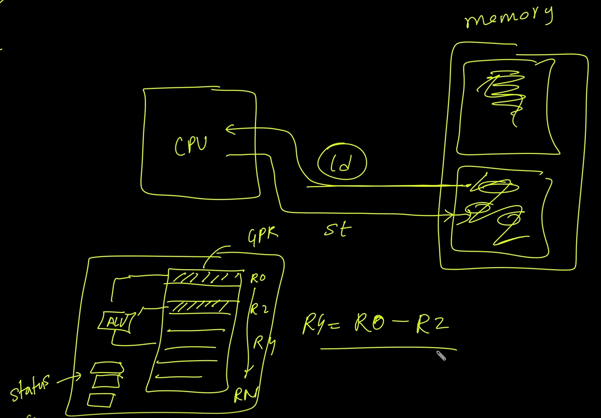
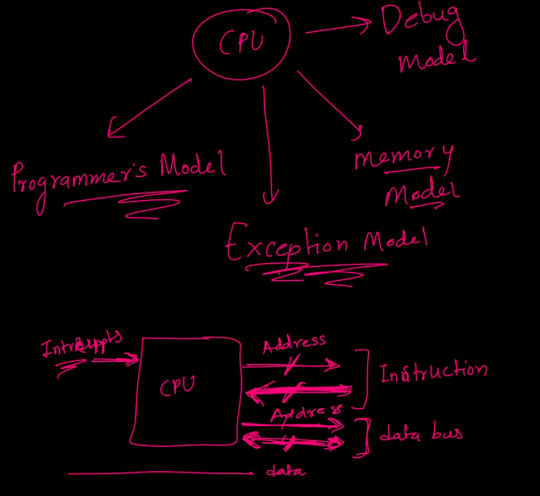
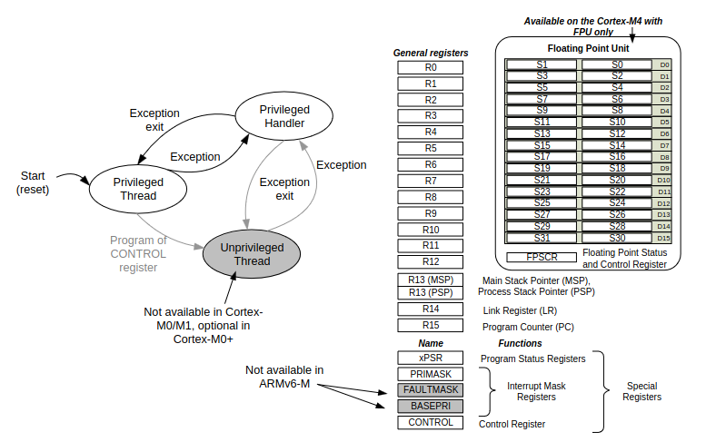
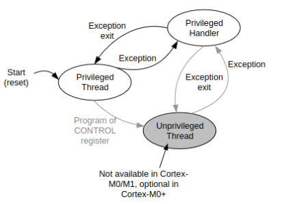
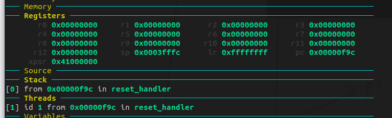

# Introduction : Arm Cortex-M 32Bit

**Arm Architecture types :**

A : Application  : apps run on linux Os , mac , windows

R: Realtime System ex : engine control

M : Microntroller  based applications , small applications

Arch specifications : what should the system do.

MIcroArch : Implementations based on the Arch specifications / documentaions ex Cortex-M0.M1.M2

# CPU , memory & RISC Architecture

Risc is ld/st architecure

 Load : Data Fetch from specific memory location  and stored in General purpose register

 Sotre : Data in register  stored to memory location

Current program status register : stores status of the program flags & others.

When function executed , the PC : address to execute next instruction after the function returns is stored in LR : linker Register

Register is a memory unit inside CPU made up of flipflops for Cortex-M they are 32bit

Arm Cortex-M based on armv[]-M 32bit arch

### Different models to learn:

1. Programmers model
2. Exception model
3. memory model
4. Debug model

* Instructions written in assembly code thats how programmer interact with the CPU
* Interrupts or Errors : IQR happenes when cpu executes instructions , So There is Exception should be handled
* Instruction Bus , Data Bus Bi Directional R/W with CPU & Memory that's how the interaction happens
* Debugger : Externel HW that can control the CPU using gdb

# Cortex-M CPU  Programmer's model

## Register Set:

* Register 16R :  r0 to r15  includes Special  :: pc : r15 , r14 : LR ,msp/psp:r13
* Program Status Register : conatins flags {N,Z..}
* FPU register included in Cortex-M4
* Interrupt Mask Register
* Control Register : used for choosing betw Stack pointers , privilege mode

  

## Modes & privileges

### **Modes:**

1. **Thread Mode** :PSP [ non-priviliege]

* This is the mode in which the processor executes application code.
* The processor starts in Thread mode after a reset.
* Can operate at either **privileged** or **unprivileged level**.

1. **Handler Mode** : uses MSP

* This mode is used for handling exceptions, including interrupts.
* When an exception occurs, the processor switches from Thread mode to Handler mode.
* Always operates at a **privileged** level.

### Privilege Levels:

1. **Privileged** :

* Has full access to all system resources and can execute any instruction.
* Can access all memory regions, including those designated as privileged.
* Can change processor configuration and control system operations , register.
* Typically used for operating system kernel code or trusted system functions.

1. **Unprivileged** :

* Has restricted access to system resources.
* Cannot access privileged memory regions or execute privileged instructions.
* Used for application code that should not have full control over the system to improve security and stability.

# Vector table & CPU boots up

* MSP with initial value at 0x00 loaded to R13,
* Reset Vector at 0x4 load  PC : R14 points to address of  instruction to  be fetched from memory

# Exploring Cortex-M3 registers using QEMU

Startupcode :

* initialize vector table
* Load Stack Pointer with MSP initial value
* start with reset handler and load memory address in program counter to start execution

# Refrence :

ARM® Cortex®-M for Beginners .
