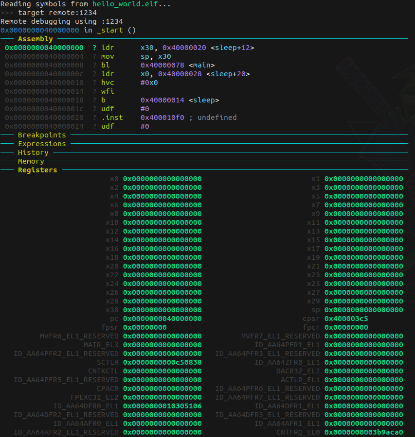

# AArch64 - armv8-a Cortex-A Notes

## ARM Architecture Overview

ARM architecture defines the overall design and functional behavior of a system, while microarchitecture specifies the detailed implementation and organization of its components.

- ARM is based on a RISC architecture, emphasizing Load-Store operations.
- RISC (Reduced Instruction Set Computing) executes basic operations in a single clock cycle for efficiency.

## ARM Execution Levels (EL)

ARM processors have multiple execution levels:

- EL0: Application level, least privileged.
- EL1: Non-secure kernel mode.
- EL2: Hypervisor mode (no secure state).
- EL3: Highest privilege, controls power state and secure world operations.

## Key Concepts

- **CSR:** Configuration Status Register.
- **Hypervisor:** Software that manages multiple operating systems by sharing hardware resources.
- **Secure World:** Secure OS and applications can access all CPU resources.
- **Non-secure World:** Limited access to CPU resources.

## Use Case Example

Consider a scenario involving secure and non-secure execution:

- EL0: Application unlocks the screen.
- EL1: Android control switches to EL3.
- EL3: Checks secure OS (EL1) for authentication.
- Secure OS (EL1): Authenticates via secure app and checks fingerprint sensor.
- EL0: Secure app verifies secure memory and responds to EL1.
- EL1: Returns to EL3 with response > EL1 Android > Application.

## Example QEMU Command for Bare Metal Development

```bash
sudo qemu-system-aarch64 -M virt -cpu cortex-a72 -nographic -smp 1 -kernel hello_world.elf -S -s
gdb-multiarch hello_world.elf > target remote :1234
```



## Notes on Bare Metal Development

When working with bare metal:

* Compile with linker script and startup code to initialize hardware.
* CPSR (Current Program Status Register) and SPSR (Saved Program Status Register) manage processor state and exceptions.
* Exceptions can be sync (system calls) or async (interrupts, IRQs, FIQs).

## Special Registers

* **PC:** Program Counter.
* **SP:** Stack Pointer.
* **ELR:** Exception Link Register.
* **SPSR:**Saved Process Status Register

## Additional ARM Architecture Details

### ARM Cortex-A53 / A57

* Both based on ARMv8-A architecture but differ in design and features.

### ARM Execution Levels (EL)

* Secure and non-secure execution modes.
* EL2 for hypervisor mode, sharing hardware resources.

### Memory and Execution Levels

* Memory can be secure or non-secure based on execution level.
* EL3 controls CPU functions like shutdown.

### Use Case: Secure World

* Secure OS interacts with secure hardware holding sensitive data.
* Flow involves EL0 application to EL3 and back for secure operations.

### ARM Registers

* General Purpose Registers (GPR): x0-x30 (64-bit), w0-w30 (32-bit).
* CPSR: Current Program Status Register , current program state register in arvm8 > Processor state
* *ALU flags like Zero, Carry, Overflow etc are stored in PSTATE / CPSR*
* SPSR: Saved Program Status Register, stores CPSR of current mode.
* Pstate loaded in SPSR , pc stored in LR
* **MPIDR:** Multiprocessor Affinity Register, identifies processors in multi-core systems.

### Exceptions and Interrupts

* Sync exceptions for system calls, async for interrupts.
* Sync : system level calls [transition between E level] , async : interrupts IQR,FIQ OR  system error
* Special registers like PC, SP, and ELR manage exception handling.
* *When exception happens it will be loaded to ELR , pc will point to it*/

### Multi-core Systems

* MPIDR identifies processor affinity in multi-core boot scenarios.
* Primary core initializes system settings for boot.

## Refrences

https://developer.arm.com/documentation/den0024/a/?lang=en
